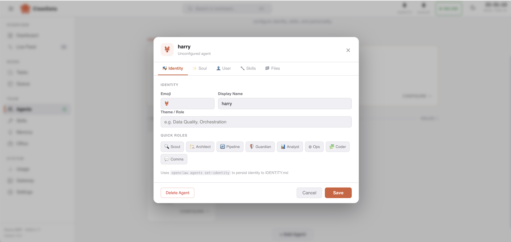
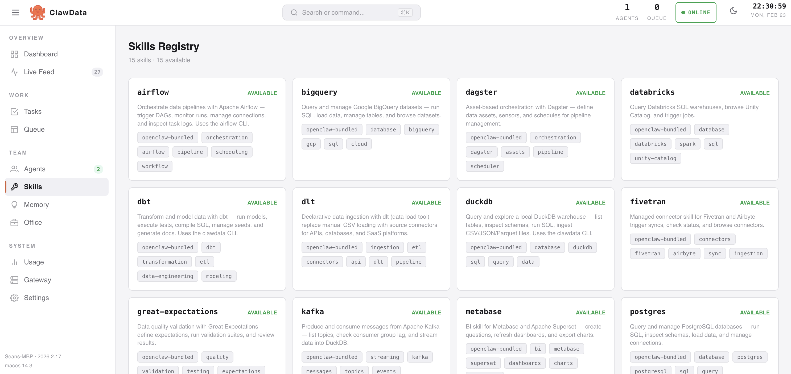
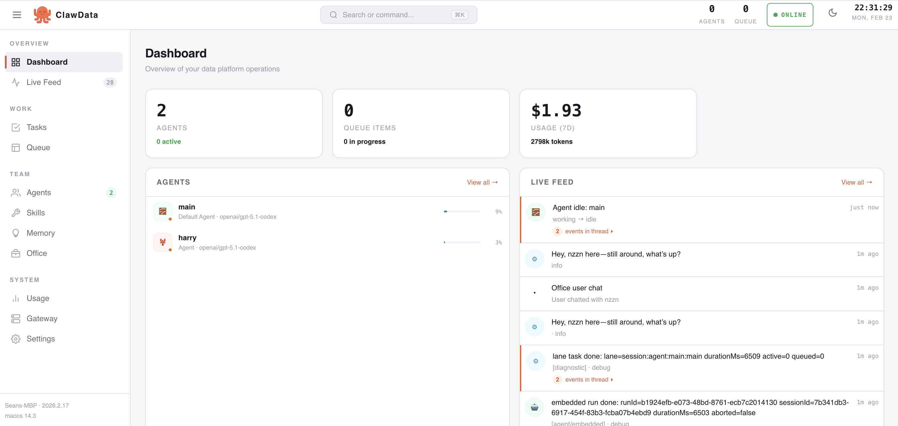
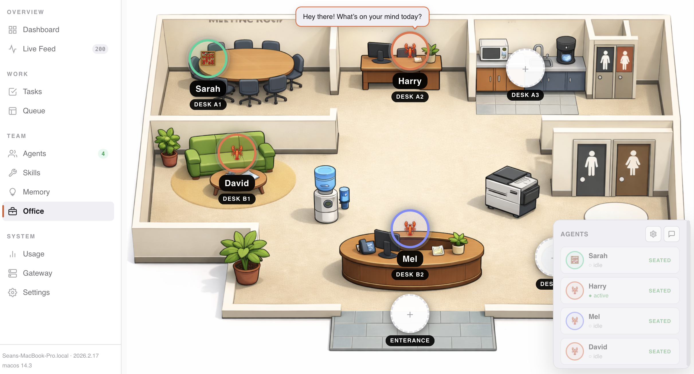

<p align="center">
  
</p>

<h1 align="center">ClawData</h1>

<p align="center">
  Open-source data engineering skills for <a href="https://github.com/openclaw/openclaw">OpenClaw</a>
</p>

---

Data engineering shouldn't feel mysterious, fragile, or reserved for big tech teams.

**ClawData** is an open-source skills library that turns [OpenClaw](https://github.com/openclaw/openclaw) into an AI-powered data engineer. Ask it to ingest files, build transformations, query warehouses, or orchestrate pipelines — and it just works.

It ships with **15 skills** covering databases, orchestration, ingestion, storage, and BI — plus companion apps for notebooks, dashboards, and data exploration.

And because it's fully open source, you can **add your own skills** for any tool your team uses.

## Mission Control

Launch Mission Control — a web-based dashboard for managing your data workspace:

```bash
clawdata mc
```

<p align="center">
  
  <br/><em>Agent management: Configure and monitor AI data engineers</em>
</p>

<p align="center">
  
  <br/><em>Skills registry: Browse and manage your 15 data engineering skills</em>
</p>

<p align="center">
  
  <br/><em>Dashboard: Real-time metrics and workspace analytics</em>
</p>

<p align="center">
  
  <br/><em>Office view: See all agents, desks, and active tasks at a glance</em>
</p>

## Demo

<p align="center">
  
</p>

## Quick start

```bash
# 1. Install OpenClaw (if you haven't already)
npm install -g openclaw@latest
openclaw onboard --install-daemon

# 2. Clone & install ClawData
git clone https://github.com/clawdata/clawdata.git && cd clawdata
./setup.sh

# 3. Start Mission Control or chat directly with OpenClaw
clawdata mc              # Web dashboard (opens http://localhost:3200)
# OR
openclaw tui             # Terminal interface
```

The setup script installs dependencies, opens an interactive skill picker, and links everything into OpenClaw. That's it — start chatting or exploring the dashboard.

## What can it do?

Once skills are linked, OpenClaw can handle data engineering requests naturally:

> *"Load the CSV files and show me what's in the data"*  
> *"Run the dbt models and tell me if any tests fail"*  
> *"Which customers have the highest lifetime value?"*  
> *"Create a new dbt model that aggregates orders by month"*

Just command-line tools that the AI agent calls on your behalf.

## Skills

| Skill | What it does |
|-------|-------------|
| **duckdb** | Query local DuckDB — SQL, tables, schemas, data ingestion |
| **dbt** | Transform data — run models, tests, compile, seeds, docs |
| **snowflake** | Query Snowflake warehouse — SQL, staging, loading |
| **airflow** | Orchestrate pipelines — DAGs, tasks, connections |
| **postgres** | Query and manage PostgreSQL databases |
| **bigquery** | Google BigQuery — query, load, manage datasets |
| **databricks** | Databricks SQL, Unity Catalog, job triggers |
| **spark** | Submit and monitor Spark jobs |
| **s3** | Cloud storage (S3 / GCS / Azure) — list, upload, download, preview |
| **kafka** | Produce/consume messages, topic management, consumer lag |
| **dlt** | Declarative ingestion pipelines with 100+ source connectors |
| **dagster** | Asset-based orchestration, sensors, schedules |
| **fivetran** | Managed connectors (Fivetran / Airbyte) — trigger syncs, status |
| **great-expectations** | Data quality validation — suites, checkpoints, results |
| **metabase** | BI dashboards (Metabase / Superset) — questions, refresh, export |

Each skill is a `SKILL.md` file that teaches the agent when and how to use the tool. Skills are symlinked into OpenClaw's workspace so the agent discovers them automatically.

### Managing skills

```bash
clawdata skills          # interactive: toggle skills on/off
clawdata doctor          # check that everything is configured correctly
```

## The `clawdata` helper

The CLI provides quick access to common workflows:

```bash
clawdata mc              # open Mission Control dashboard (port 3200)
clawdata skills          # manage which skills are enabled
clawdata doctor          # verify setup and configuration
clawdata help            # full command reference
```

## Architecture

ClawData includes sample data and a medallion-architecture dbt project:

- **Bronze** — raw ingestion views (`SELECT *` from source)
- **Silver** — cleans, deduplicates, normalises, and validates
- **Gold** — dimensional model (dims + facts) and analytics

## Project structure

```
clawdata/
├── skills/                ← 15 skill definitions (SKILL.md files)
├── src/                   ← TypeScript CLI source
│   ├── mission-control/   ← Web dashboard
│   └── lib/               ← Core functionality
├── templates/             ← Sample apps (dbt, Jupyter, Evidence, etc.)
└── data/                  ← DuckDB warehouse + sample files
```

## Adding custom skills

Create a `SKILL.md` file in `skills/your-tool/` that teaches the AI how to use your tool:

```markdown
---
name: my-tool
description: What this skill does
tools:
  - my-tool-cli
---

## When to use
When the user asks for...

## Commands
List available commands and what they do.
```

Then run `clawdata skills` to enable it. The agent will discover it automatically.

## Configuration

Configuration is auto-detected. Run `clawdata doctor` to verify your setup.

## License

MIT
