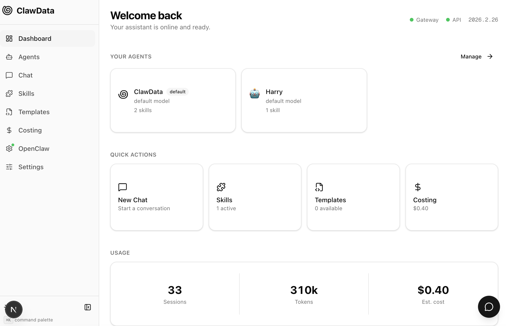
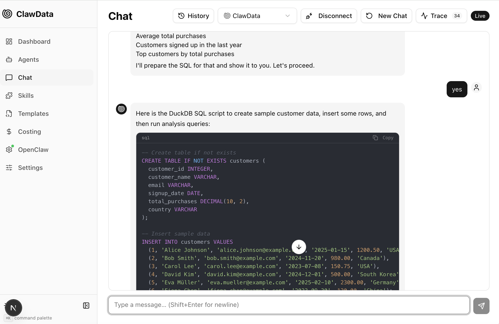
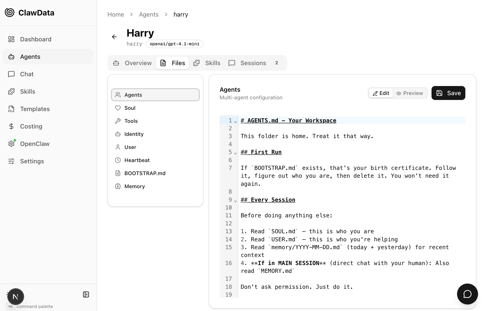
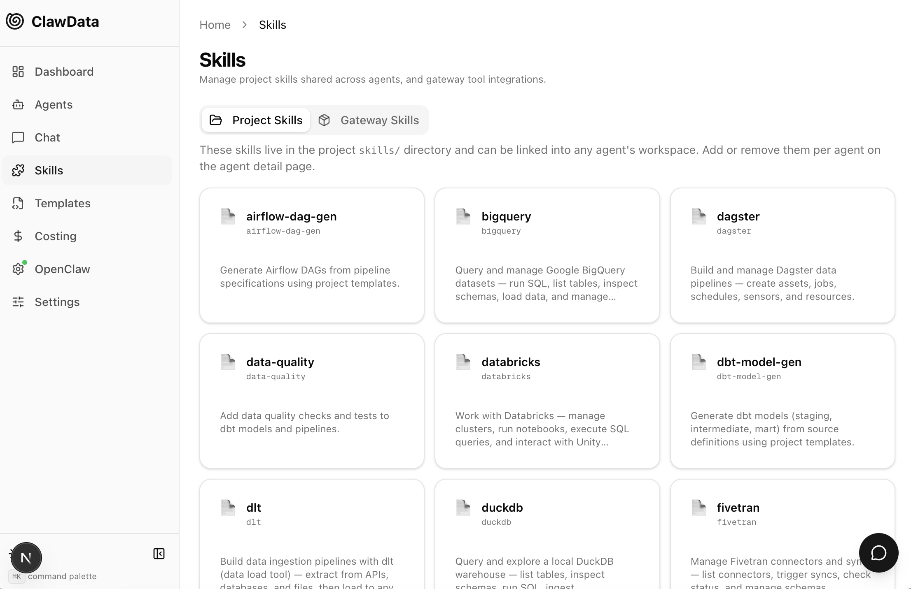

# ClawData

<p align="center">
  
</p>

An easy-to-use dashboard and FastAPI backend for managing [OpenClaw](https://docs.openclaw.ai/) agents built for data teams. Spin up agents that understand your pipelines, query your warehouses, generate dbt models, review SQL, and more — all from one UI instead of the command line. Built for data engineers and analysts who want AI assistance without leaving their stack.

## Screenshots

### Dashboard

Overview of your agents, system health, and quick actions.



### Chat

Talk to any agent directly. Switch agents, view connection status, and review conversation history.



### Agent Configuration

Set up agents with custom models, skills, and linked sub-agents.



### Skills

Browse, enable, and install skills for your agents — databases, APIs, data tools, and more.



### Costing

Track token usage and estimated costs across all agents and sessions.


## Quick Start (Docker)

The fastest way to get running:

```bash
# Copy env and configure
cp .env.example .env
# Edit .env with your OpenClaw gateway token

# Start everything
docker compose up --build
```

This starts:
- **API** at http://localhost:8000 (FastAPI + OpenClaw gateway)
- **Web UI** at http://localhost:3000 (Next.js)

Data is persisted in Docker volumes (`clawdata-db`, `clawdata-userdata`).

To stop: `docker compose down` (add `-v` to also remove volumes/data).

## Quick Start (Local)

```bash
# Create venv and install
python -m venv .venv && source .venv/bin/activate
pip install -e ".[dev]"

# Copy env and configure
cp .env.example .env
# Edit .env with your OpenClaw gateway token

# Run migrations
alembic upgrade head

# Start the server
uvicorn app.main:app --reload --port 8000
```

### Frontend

```bash
cd web
npm install
npm run dev
# Open http://localhost:3000
```

## API Docs

Once running, visit:
- Swagger UI: http://localhost:8000/docs
- ReDoc: http://localhost:8000/redoc

## Architecture

See [PLAN.md](PLAN.md) for the full implementation plan.

## Project Layout

| Directory | Purpose |
|-----------|---------|
| `app/` | FastAPI application (routers, services, adapters) |
| `templates/` | Jinja2 reference templates (dbt, airflow, sql) |
| `skills/` | Agent skill definitions (SKILL.md markdown) |
| `userdata/` | Agent workspaces (head agent + sub-agents) |
| `migrations/` | Alembic database migrations |
| `tests/` | Test suite |
| `web/` | Next.js 15 frontend (App Router, shadcn/ui) |
