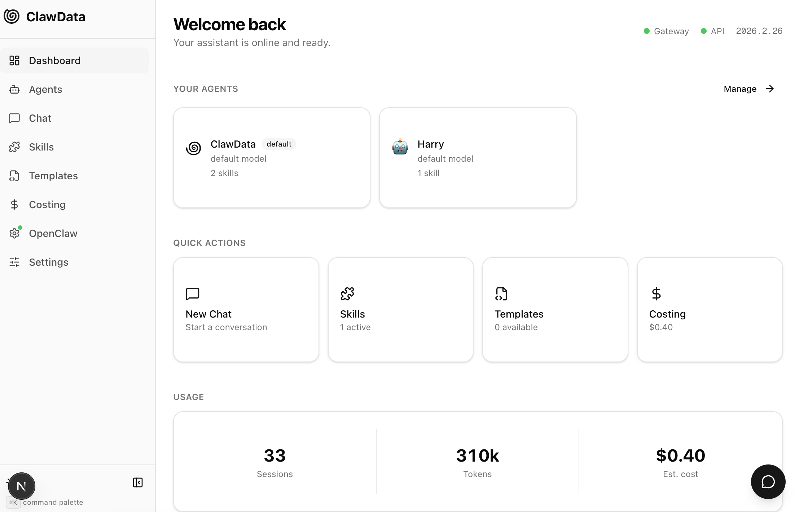
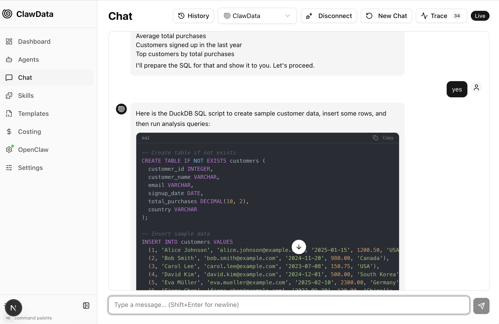
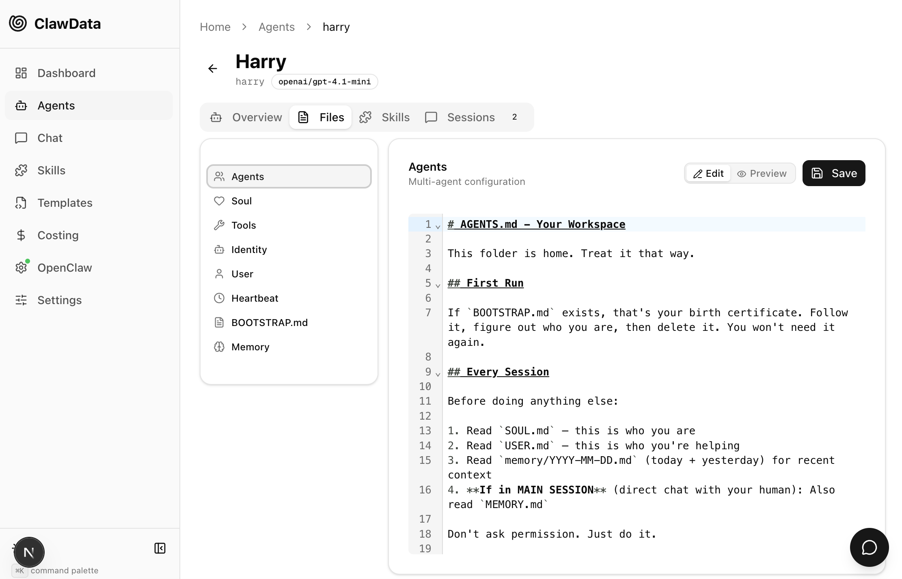
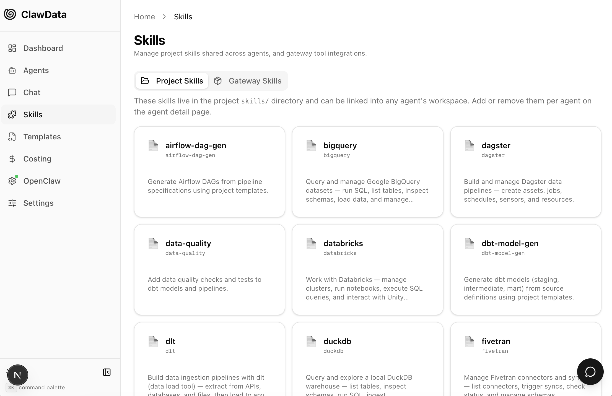
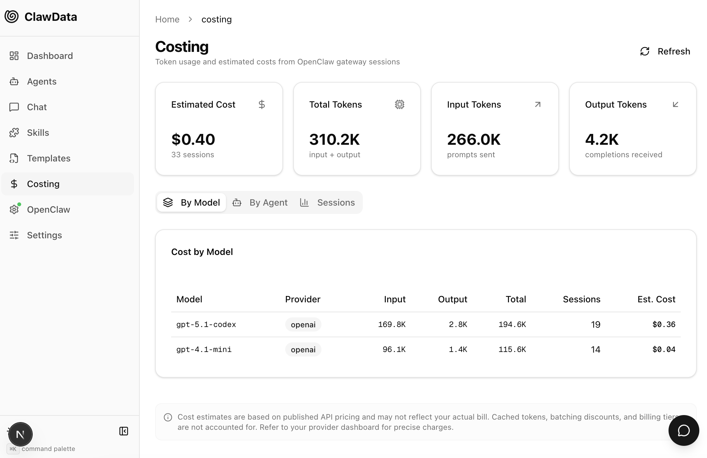

# ClawData

<p align="center">
  
</p>

An easy-to-use dashboard, CLI, and FastAPI backend for managing [OpenClaw](https://docs.openclaw.ai/) agents built for data teams. Spin up agents that understand your pipelines, query your warehouses, generate dbt models, review SQL, and more — from the web UI or the terminal. Built for data engineers and analysts who want AI assistance without leaving their stack.

## Screenshots

### Dashboard

Overview of your agents, system health, and quick actions.



### Chat

Talk to any agent directly. Switch agents, view connection status, and review conversation history.



### Agent Configuration

Set up agents with custom models, skills, and linked sub-agents.



### Skills

Browse, enable, and install skills for your agents — databases, APIs, data tools, and more.



### Costing

Track token usage and estimated costs across all agents and sessions.



## Quick Start (Docker)

The fastest way to get running:

```bash
# Copy env and configure
cp .env.example .env
# Edit .env with your OpenClaw gateway token

# Start everything
docker compose up --build
```

This starts:
- **API** at http://localhost:8000 (FastAPI + OpenClaw gateway)
- **Web UI** at http://localhost:3000 (Next.js)

Data is persisted in Docker volumes (`clawdata-db`, `clawdata-userdata`).

To stop: `docker compose down` (add `-v` to also remove volumes/data).

## Quick Start (Local)

```bash
# Create venv and install
python -m venv .venv && source .venv/bin/activate
pip install -e ".[dev]"

# Copy env and configure
cp .env.example .env
# Edit .env with your OpenClaw gateway token

# Run migrations
alembic upgrade head

# Start the server
uvicorn app.main:app --reload --port 8000
```

### Frontend

```bash
cd web
npm install
npm run dev
# Open http://localhost:3000
```

### CLI

ClawData includes an interactive CLI for managing agents and skills without the web UI:

```bash
# Launch the interactive menu
clawdata

# Or jump straight to a section
clawdata skills       # Toggle skills on/off per agent (↑↓ navigate, Space toggle, Enter confirm)
clawdata agents       # Browse, create, and configure agents
clawdata gateway      # Gateway health, logs, models, and providers
clawdata templates    # Browse project templates
clawdata status       # Quick system overview
clawdata setup        # Guided setup wizard
clawdata tui          # Launch the OpenClaw TUI
```

Skill management uses an interactive checklist — arrow keys to move, space bar to toggle, enter to apply:

```
  Skills for 🦞 main  (↑↓ navigate, Space toggle, Enter confirm)
> [x] Azure
  [ ] BigQuery
  [x] Data Analysis
  [x] Databricks Skill
  [ ] dbt
  [ ] DuckDB
  ...
```

All commands also have non-interactive variants for scripting:

```bash
clawdata skills list --project
clawdata skills deploy dbt --agent main
clawdata agents list --gateway
clawdata gateway health
```

## API Docs

Once running, visit:
- Swagger UI: http://localhost:8000/docs
- ReDoc: http://localhost:8000/redoc

## Architecture

See [PLAN.md](PLAN.md) for the full implementation plan.

## Project Layout

| Directory | Purpose |
|-----------|---------|
| `app/` | FastAPI application (routers, services, adapters) |
| `app/cli/` | Interactive CLI (`clawdata` command) |
| `templates/` | Jinja2 reference templates (dbt, airflow, sql) |
| `skills/` | Agent skill definitions (SKILL.md markdown) |
| `userdata/` | Agent workspaces (head agent + sub-agents) |
| `migrations/` | Alembic database migrations |
| `tests/` | Test suite |
| `web/` | Next.js 16 frontend (App Router, shadcn/ui) |
